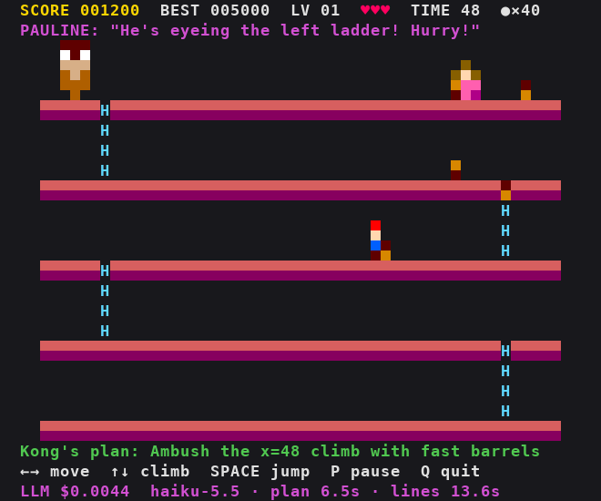

# AI Kong: A Pattern for using Slow Reasoning LLMs for Fast Games




A terminal Donkey Kong where Kong can be driven by an LLM that **studies how you play and re-plans
its tactics**, without ever making the game lag. Pure Python standard library: no installs
(`python-dotenv` is optional, to load settings from `.config/`).

The article behind it, with published and measured LLM speed and cost data:
[Using Slow Reasoning LLMs for Fast Games](docs/article/llm-real-time-game-2026-10.md).


## Quick start

```bash
git clone https://github.com/alexcpn/ai-kong.git && cd ai-kong

python3 dk.py                                      # menu: pick an opponent and a board
```

In a game: arrows (or WASD) move, Space jumps, P pauses, Q quits.

**Default models (cheapest):** `anthropic/claude-haiku-5.5` for the strategist (medium reasoning,
every ~20 s and when you lose a life or clear a level, ~6 s per plan) and for the voice that writes
the characters' lines (every ~30 s and after each new plan; ~14 s, but written ahead so nobody waits).
About $0.0007 per strategy call and $0.0013 per set of lines: roughly $0.005-0.008 per minute of play,
5-8 cents for a 10-minute session. The running total is shown at the bottom right.

**Fast setup (optional):** each role can use its own model and provider. With the fastest set we
measured (Oct 2026), and a third role, the tactician, that picks Kong's actual throws at every
decision:

| Role | When | Model @ provider | Reply time |
|---|---|---|---|
| Strategist | every ~20 s, and when you lose a life or clear a level | `openai/gpt-oss-120b` @ Cerebras, medium reasoning | ~2-2.5 s |
| Tactician | every Kong decision (~2 s) | `openai/gpt-oss-20b` @ Groq, low reasoning | ~0.6-1 s |
| Voice | writes the characters' lines, every ~30 s | `openai/gpt-oss-120b` @ Groq, low reasoning | a few seconds, written ahead |

It costs about 1-1.5 cents per minute. Switch by uncommenting the fast block in `.config/config.env`
(settings: `KONG_<ROLE>_MODEL`, `_REASONING`, `_PROVIDER` for `DIRECTOR`, `TACTICIAN`, `VOICE`, and
`KONG_USE_TACTICIAN=1`). The measurements behind these numbers are in `docs/llm-speed/`.

To configure AI Kong from files instead of the shell, put the key in
`.config/opneroutere.env` (git-ignored; copy `.config/opneroutere.env.ex`) and settings in
`.config/config.env`, then `pip install python-dotenv`. `dk.py` loads both at start-up, and
variables already set in your shell take precedence.

Use a terminal of at least 60 × 25 (60 × 29 for the Tall board). On a 256-colour terminal (most today)
Kong, Pauline, the barrels and you are small pixel-art sprites; with fewer colours you get plain
character art. Pick an opponent and a board in the menu, then climb to Pauline (`|♀|`)
at the top while Kong throws barrels. From level 2, fireballs (`※`) roam the girders too.

## Controls

| Key | Action |
|---|---|
| ← → / A D / H L | walk (you can steer in the air) |
| ↑ ↓ / W S / K J | climb up / down a ladder (step off mid-ladder to drop) |
| Space / Enter | jump (hold for a little extra height) |
| P | pause |
| Q | end the game |

## Opponents

| Kong | Style |
|---|---|
| **AI Kong** | An LLM watches your habits (where you wait, how early you jump, which ladders you use, how you died) and re-plans Kong's tactics every ~20 seconds, and after every life you lose. Its current plan is shown under the board |
| Classic (no LLM) | Arcade rhythm: one barrel at a time, random routes. For testing without a key or network |

**Kong moves and his barrels are limited**: he comes down from the top and roams about three girders
above you, climbing as you climb (up to the top girder), and throws from wherever he is (AI Kong
picks the spot, e.g. above a ladder you need). Catch him anywhere but the top girder and he's beaten.
He has 45 barrels on level 1, 8 more each level, shown as `●×45` at the top; they refill on a new
level, not when you lose a life.

**Kong, Pauline and you talk.** Kong mocks you, Pauline cheers you on (and sometimes hints at Kong's
plan: "He's eyeing the left ladder!"), and your own character reacts ("Whoa, that was close!"). With AI
Kong the lines are written by an LLM a few times a minute, fitted to how you play and to Kong's current
plan, and the game picks one the instant something happens, so nobody waits for the network. Classic
Kong uses built-in lines.

**Catch Kong**: he roams a few girders above you, so if you get to him anywhere but the top girder,
touch him and he's beaten: +3000 and the level is cleared.

Boards: **Random** (a new layout each game), **Classic**, **Tall** (6 girders), **Sparse** (a
single ladder between girders). Use `--seed N` to replay the same board.

## Scoring

The game is endless; you play for score. High scores are kept per opponent, in
`~/.cache/dk-game/highscores.json`.

| Event | Points |
|---|---|
| Reach a higher girder (once per girder per level) | 100 |
| Jump over a barrel | 100 |
| Land on a fireball from above (destroys it) | 200 |
| Clear a level | 1000 × level + 10 × seconds left |

You have 3 lives, and each level has a time limit: running out costs a life. Each level is harder.

## AI Kong

It needs an [OpenRouter](https://openrouter.ai) API key. Create the key file once in your own terminal:

```bash
mkdir -p ~/.config/dk-game
printf 'OPENROUTER_API_KEY=%s\n' 'sk-or-...' > ~/.config/dk-game/openrouter.env
chmod 600 ~/.config/dk-game/openrouter.env
```

(or export `OPENROUTER_API_KEY`). See Quick start for AI Kong's three roles, their default models,
speeds and costs. To use another model:

```bash
KONG_DIRECTOR_MODEL=anthropic/claude-haiku-5.5 KONG_DIRECTOR_PROVIDER= python3 dk.py --kong ai  # any provider
KONG_DIRECTOR_REASONING=high python3 dk.py --kong ai       # more deliberate plans
KONG_USE_TACTICIAN=0 python3 dk.py --kong ai               # strategist + knobs only
```

## How it stays fair and lag-free:

- The LLM never moves barrels itself. The strategist sets 8 **knobs** for a deterministic Kong: throw rate,
  speed mix, route mix, burst chance, ladder ambush, rhythm jitter, hold-back lulls and where Kong
  stands. The tactician only chooses each throw's timing, speed and route, within the engine's limits.
- Every change is clamped to limits, and changes are rate-limited.
- A **fairness guard** simulates proposed changes with a near-perfect player and vetoes any that
  would make the game unwinnable.
- The LLM runs in the background, so the game never waits for it. Until its first plan arrives,
  Kong plays its default tactics.

How the LLM is used: it is far too slow to steer anything moment to moment, so it acts as a
commander. Every ~20 seconds (and when you lose a life or clear a level) the strategist, with
reasoning, studies your habits and sets Kong's 8 knobs (throwing tactics and where he stands); the
engine carries that out every tick. With a fast inference provider a third role becomes possible:
the tactician, consulted at every Kong decision (~2 s), turns the plan into the actual throws for
what you are doing right now. It never makes the game wait: if its reply takes longer than 1.2 s,
Kong uses his knob-driven throws for that window, and the screen shows how often that happened
("tactician ... 20% late"). A separate call writes the characters' lines ahead of time, so speech
never waits on the network either.
The knob limits and fairness guard apply to the strategist; the engine's per-level limits (throws
per decision, gaps, barrels on screen) apply to every throw, whoever chose it.

The bottom row shows the LLM side as you play: which models play Kong, their average reply time, the
number of calls and the running cost (e.g. `LLM  haiku-5.5 · plan 6.5s · lines 13.6s · 9 calls  $0.0044`).
The menu shows the models before you start, and the game-over line the total.

Only AI Kong uses the network: it sends OpenRouter a summary of the game state and your play
statistics. Nothing else leaves your machine.

## How it's built

```
dk.py                 the game: menu, play loop, scoring, high scores
dkgame/engine.py      deterministic engine (fixed 20 ticks/s, boards, physics, Kong interface)
dkgame/kongs.py       scripted Kongs
dkgame/director_kong.py   knob-driven Kong + the LLM director, fairness guard simulation
dkgame/llm_kong.py    an earlier two-layer LLM Kong (strategist + tactician); kept for comparison
dkgame/lookahead.py   near-perfect reference player used by the fairness guard
dkgame/render.py      curses drawing
director/             the reusable "AI director" library (see director/README.md)
```

The [`director/`](director/README.md) library is game-agnostic. Use it to put LLM reasoning behind
typed knobs in any real-time game or simulation.

## Tests

```bash
python3 -m unittest discover .        # from the repo root: game + director library tests
```

This game came out of an experiment in benchmarking coding agents and evolved into this!
