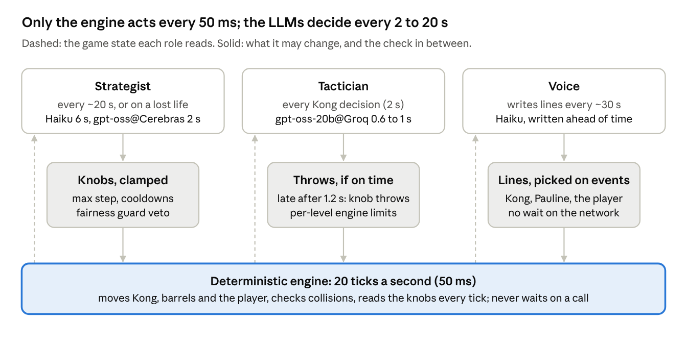
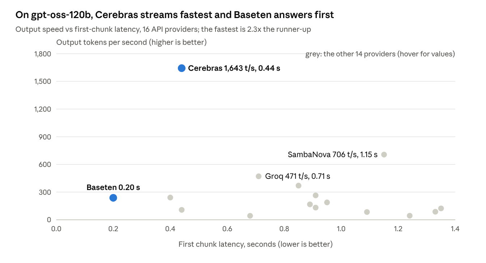
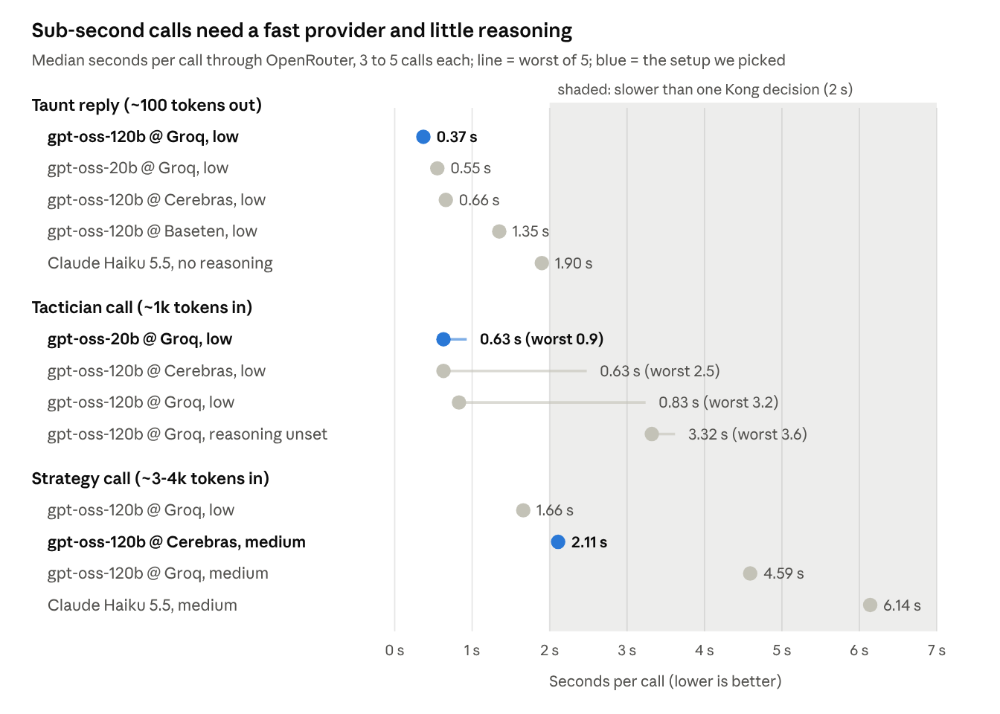

# Using Slow Reasoning LLMs for Fast Games

## AI Kong - A fun take on Donkey Kong

*9 October 2026 · Alex Punnen*

LLMs are graded on intelligence, not speed. The smartest ones are too big or power-hungry for the edge, so they run in the cloud and pay network latency on top. For real-time reasoning in games, cars or robots, that is a problem.

Chips like Cerebras, which keep weights in on-chip memory, make serving fast. I wanted to see how far that gets you, so I built a test: Donkey Kong, one of the few handheld games I played as a child, with Kong controlled by a reasoning LLM.

Even on Cerebras, a reasoned strategy call takes about 2 s. That is too slow for driving, robots or embedded systems.

In October 2026 an LLM can sit inside a real-time game at three speeds: about 0.4 s for a spoken reply, about 1 s for a per-move tactical choice, and about 2 s for a reasoned strategy. That is fast enough for a decision every 2 seconds, and still 20 to 50 times too slow for a single 50 ms frame.

## The problem: seconds against milliseconds

The game runs a fixed 20 ticks a second, so every frame has 50 ms. A typical hosted LLM call took 2 to 6 s in our first version (Claude Haiku 5.5 through OpenRouter). Calling the model per frame, or even per move, would freeze the game.

The question this article answers: if even the fastest LLM is too slow for the game loop, how do you design a fast system around a slow input? Which decisions can the model own, which must stay in deterministic code, and what does that cost per minute of play?

## The pattern: slow minds, fast hands

The LLM never touches the frame loop. Each role runs in a background thread, the engine polls for finished replies once a tick, and a check sits between every role and the game.

*AI Kong architecture · 3 LLM roles, 1 deterministic engine*

- **Strategist.** Studies a compact player profile (where they wait, how early they jump, which ladders they use, how they died) and the results of its own earlier plans. It sets 8 typed knobs: throw rate, speed mix, route mix, burst chance, ladder ambush, rhythm jitter, hold-back lulls and where Kong stands. Every change is clamped, rate-limited, and simulated against a near-perfect player before it applies.
- **Tactician.** Possible only with sub-second inference. At each Kong decision it reads the live board and the strategist's plan and picks the actual throws. If it misses a 1.2 s deadline, Kong uses the knob-driven throws for that window.
- **Voice.** Answers the player's taunts in character and may decide Kong takes the bait. A local grunt answers instantly, so the player never waits on the network.

With a slow model (Haiku, 2 to 6 s) only the strategist and the voice are usable. With the fastest providers today the tactician becomes practical.

## Published speed data

No provider leads on both measures. On the same open-weight model, Cerebras streams output 2.3 times faster than the runner-up, SambaNova, and 3.5 times faster than Groq, while Baseten returns its first chunk soonest.

*Source: [Artificial Analysis, gpt-oss-120B providers page](https://artificialanalysis.ai/models/gpt-oss-120b/providers), read 9 Oct 2026 · P50 over 72 h, 10,000-token input*

- **Time to the answer, not the first chunk.** Artificial Analysis also ranks time to the first answer token, including reasoning: Cerebras 1.66 s, SambaNova 3.98 s, Groq 4.95 s. A fast first chunk does not help if the model then reasons for seconds.

## What we measured

Through OpenRouter, the fastest setups answered a taunt in 0.37 s, chose a move in 0.63 s and wrote a strategy in 2.1 s. That is 3 to 5 times faster than Claude Haiku 5.5, which took 1.9 s and 6.1 s for the same calls.

*Measured 9 Oct 2026 through OpenRouter, provider pinned, strict JSON output · [data-2026-10.json](../llm-speed/data-2026-10.json)*

Every call used the game's real prompt and a strict JSON schema, with the provider pinned and fallbacks off. The samples are small, so read the medians as orders of magnitude and the worst-of-5 lines as warnings.

In the live game, wall-clock latency ran higher than in isolated calls, because three roles share one connection and the game runs alongside them. Two 40-second runs, with a simple bot playing:

| Configuration | Strategist avg | Tactician avg | Tactician late | Voice avg | Cost of the run |
| --- | --- | --- | --- | --- | --- |
| Tactician gpt-oss-120b @ Groq, 1.0 s deadline | 1.4 s | 1.6 s | 69% | 0.8 s | $0.0097 for 29 s |
| Tactician gpt-oss-20b @ Groq, 1.2 s deadline | 2.6 s | 1.0 s | 20% | 0.7 s | $0.0093 for 28 s |

Both runs used gpt-oss-120b @ Cerebras (medium) for the strategist and gpt-oss-120b @ Groq (low) for the voice. Swapping the tactician to the 20b model cut late windows from 69% to 20%.

## Cost

The fast setup costs about 1 to 1.5 cents per minute of play, four to five times the slow one, and the strategist is most of it. Per-call costs below are what OpenRouter billed us; per-minute figures assume 3 to 5 strategy calls a minute (one every 20 s, plus one per lost life) and a tactician call every 2 s.

| Setup | Strategist per call | Tactician per call | Voice per taunt | Per minute of play |
| --- | --- | --- | --- | --- |
| Slow: Claude Haiku 5.5, no tactician | $0.0006 to $0.0008 | none | $0.00007 | $0.002 to $0.003 |
| Fast: gpt-oss-120b @ Cerebras medium, gpt-oss-20b @ Groq low, gpt-oss-120b @ Groq low | $0.0022 | $0.00012 | $0.0001 to $0.0003 | $0.010 to $0.015 |
| Fast, cheaper: strategist gpt-oss-120b @ Groq low | $0.00067 | $0.00012 | $0.0001 to $0.0003 | about $0.006 |

The live runs agree: a 28 s game with the fast setup cost $0.0093, and a 45 s game with the slow setup cost $0.0028. A 10-minute session costs about 10 to 15 cents fast, or 2 to 3 cents slow. AI Kong ships with the slow, cheap setup and offers the fast one as a configuration switch.

## What we learned

For short game calls, reasoning tokens decide latency more than the hardware does. Tokens per second only pay off once the model stops thinking out loud.

1. **Reasoning tokens are the latency budget.** gpt-oss-120b on Groq at low reasoning spent about 184 tokens thinking per tactician call and took 0.83 s median. With reasoning left unset it spent 1,129 tokens and took 3.3 s, on the same hardware. gpt-oss-20b at low reasoning thought for about 20 tokens and answered in 0.63 s.
2. **Plan for the tail, not the median.** Medians of 0.6 to 0.8 s hid single calls of 2.5 to 3.2 s. At a 2 s decision cycle the tail is what the player feels, so every real-time call needs a deadline and a fallback.
3. **Benchmarks are not your request.** Groq answered our ~100-token taunt reply in 0.37 s, but our ~1,000-token tactician call took about 1 s live, and published leaderboards use 10,000-token prompts. Measure the exact prompt, schema and reasoning setting you will ship.
4. **Provider beats model for strategy.** The same gpt-oss-120b at medium reasoning took 4.6 s on Groq and 2.1 s on Cerebras, the throughput leader on [Artificial Analysis](https://artificialanalysis.ai/models/gpt-oss-120b/providers). Long reasoning outputs reward raw tokens per second; short replies reward low time to first token.
5. **Never let the game wait.** Every LLM call runs in a background thread and is polled each tick. A late tactician reply is discarded and Kong uses his knob-driven throws for that window. Over a live run, 20% of windows fell back and the game never stalled.
6. **Bound what the model can do.** The strategist only moves typed knobs, clamped per update and checked by a fairness guard that simulates a near-perfect player. Every throw, whoever chose it, still passes the engine's per-level limits. Speed changed what the LLM decides, not what it is allowed to do.

These are small samples: 3 to 5 calls per configuration, one machine, one day.

## What it means for robots

Robots get around the latency problem by keeping the LLM out of the control loop, the same way AI Kong does. A slow model reasons and sets goals a few times a second. A small, fast policy turns those goals into motion at tens to hundreds of hertz. Classical controllers and safety reflexes run underneath and never wait on a model.

| System | Slow layer (reasons) | Fast layer (acts) | Where it runs |
| --- | --- | --- | --- |
| [Figure Helix](https://www.figure.ai/news/helix) | 7B vision-language model at 7–9 Hz | 80M-parameter policy at 200 Hz | Onboard, low-power embedded GPUs |
| [NVIDIA GR00T N1](https://the-decoder.com/?p=22397) | Vision-language model for perception and planning | High-frequency motor-control network | Robot or edge |
| [Physical Intelligence π0 with real-time chunking](https://www.pi.website/research/real_time_chunking) | One flow-matching VLA | 50-action chunks, 1 s of motion each | Works with 100–300 ms of inference delay, remote or local |
| [Gemini Robotics On-Device](https://deepmind.google/discover/blog/gemini-robotics-on-device-brings-ai-to-local-robotic-devices/) | Gemini Robotics model, distilled | Same model | On the robot, no network needed |

Two ideas carry over directly from AI Kong. First, the fast layer does not decode tokens one by one: a diffusion or flow-matching action head emits a whole chunk of motor commands in one pass, avoiding the token-by-token decoding that dominates our 2 s strategy calls. Second, the next chunk is computed while the current one plays, so model latency is hidden rather than waited on; that is our "never let the game wait" rule. Hardware like Cerebras makes the slow layer smarter per second, but safety-critical control stays on the robot.

## Can a local model on the laptop do it?

Yes, for the fast layer. On a laptop RTX 3060 (6 GB) with Ollama 0.40, Gemma 4 E2B made a tactician decision in 0.51 s median (worst 0.76 s) and answered a taunt in 0.35 s. That matches gpt-oss-20b on Groq with a tighter tail, at no cost per call and with no network.

| Model on the local GPU (RTX 3060 Laptop, 6 GB, Ollama 0.40) | Taunt reply | Tactician call, median / worst | What it decided |
| --- | --- | --- | --- |
| Gemma 4 E2B (4.6 GB) | 0.35 s | 0.51 s / 0.76 s | 1 to 3 throws, follows the plan, legal speeds; always puts Kong at the far right |
| Gemma 3 1B (0.8 GB) | 0.22 s | 0.30 s / 2.8 s | no throws in 7 of 8 calls: fast because it does little |
| Qwen 3.5 4B (3.3 GB) | 0.66 s | 1.36 s / 1.73 s | most varied; once picked a speed the level does not allow |
| Llama 3.2 3B (2.0 GB) | 0.43 s | 0.4 to 1.9 s across runs | picks speeds the level does not allow |
| gpt-oss-20b @ Groq, cloud, same hour | ~0.4 s | 0.6 to 1.05 s, single calls up to 3.2 s | 1 to 2 throws, follows the plan, legal speeds |

Three things decided the result. **Thinking off:** Gemma 4 and Qwen 3.5 reason by default, and Gemma 4 spent all 400 output tokens thinking and returned no JSON until the request set reasoning effort to none. **A clean GPU:** a leftover runner held 1.8 GB of video memory, and Qwen first loaded 71% on the CPU at 2 to 6 s per call. **The runtime:** updating Ollama from 0.22 to 0.40 cut Llama 3.2 3B's taunt reply from 0.90 s to 0.43 s.

We checked what each model decided, not only how fast: 8 tactician calls on one level-1 board, with the strategist's plan to ambush climbs. Each model also takes 1 to 15 s to load on its first call, so it must be warmed up before play.

So a small local model can run the fast layer below a second, the way Helix's System 1 runs on the robot, while the slow strategist stays in the cloud. For per-frame control the better route is still a tiny policy trained on the tactician's decisions, running inside the game in under a millisecond.

## Reproduce it

The game, the director library and the benchmark scripts are in the AI Kong repository. The raw figures, sources and methods are in [`docs/llm-speed/data-2026-10.json`](../llm-speed/data-2026-10.json), and [`docs/llm-speed/bench_*.py`](../llm-speed/) re-run each measurement through OpenRouter for well under a cent each (`bench_local_ollama.py` and `bench_tactics_quality.py` cover the local GPU). The game ships with the cheap Haiku setup; the fast setup is one block in [`.config/config.env`](../../.config/config.env).

## Sources

- [Artificial Analysis: gpt-oss-120B API providers](https://artificialanalysis.ai/models/gpt-oss-120b/providers): speed and first-chunk latency per provider, P50 over 72 hours, 10,000-token input
